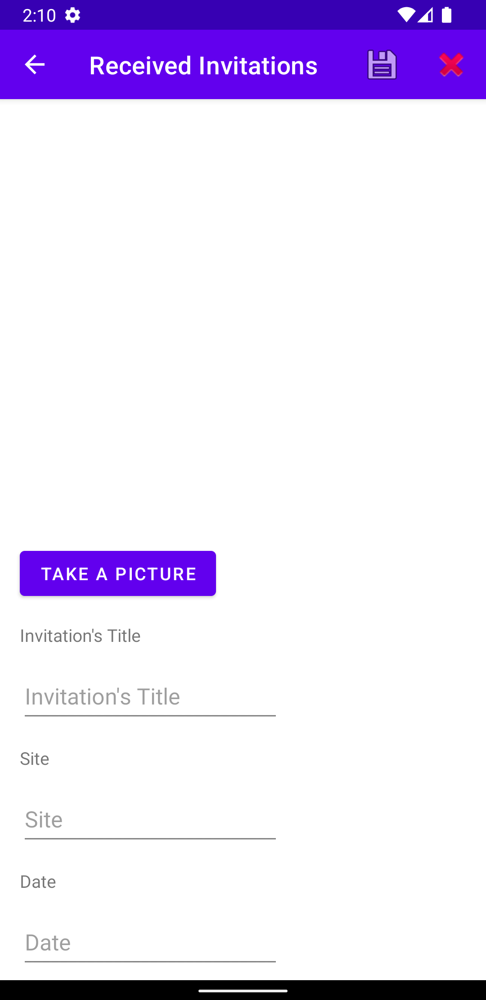

# Invitation Received Management

This app helps the user to store his received invitations. The user inserts informations such as picture of the event, name, date, state, allows only men, women or both, site, price, allow drinking alcohol.

## 🚀 Starting

This instructions will allow you to fetch a project's copy in your local computer for maintaining and testing purposes.

```
git clone https://github.com/nagaoka-thiago/controledeconvitesrecebidos.git
```

### 📋 Screenshots

<div>



</div>

### 📋 Built using

You are going to need the following to run this project in your local computer.

- Room 2.3.0
- Android Studio
- Virtual Device of Pixel 5 API 27
